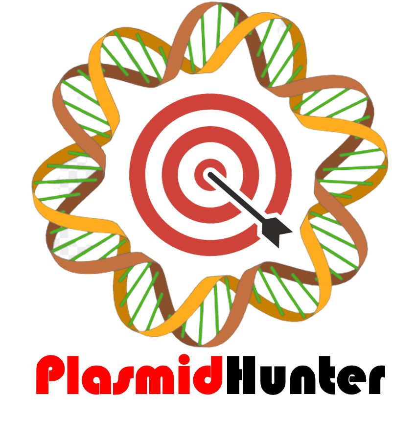

presented by Institute of Food Safety and Health, Illinois Institute of Technology

# PlasmidHunter: Accurate and Fast Plasmid Prediction Based on Gene Content Using Machine Learning 

Plasmids are extrachromosomal DNA found in many bacterial species. They often carry beneficial genes that help bacteria adapt to harsh conditions, but they can also carry genes that make bacteria harmful to humans, such as those that cause antimicrobial resistance (AMR) or virulence. Plasmids are important tools in genetic engineering, gene therapy, and drug production, and are being extensively studied. However, it can be difficult to identify plasmid sequences in genomic and metagenomic data, which often contain both chromosomal and plasmid sequences. To address this problem, we have developed a new tool called PlasmidHunter, which uses machine learning to predict plasmid sequences from assembled sequences based on gene content profile. PlasmidHunter achieved high accuracies (up to 96.7%) and fast speeds (minutes) in benchmark tests, outperforming other existing tools in accuracy, recall, and F score.

Keywords: artificial intelligence (AI), machine learning (ML), plasmid prediction, genomic sequencing

## Run PlasmidHunter online
We have built a Google Colab Notebook runtime and you can upload your input fasta file(s) to run it online.
Go to https://colab.research.google.com/github/tianrenmaogithub/PlasmidHunter/blob/main/PlasmidHunter.ipynb,
or click the PlasmidHunter.ipynb in the repository and then click the Colab icon to run it.
## Run PlasmidHunter locally
### Dependencies
scikit-learn == 1.0.2 
pandas >= 1.4.3 
numpy >= 1.23.1 
biopython >= 1.79 
diamond >= 2.0.15.153 
prodigal >= 2.6.3 
### Installation and run
Please install the dependencies then download the source code file PlasmidHunter_x.x.zip and unzip it. Run python PlasmidHunter_x.x/bin/PlasmidHunter.py -h for the help message.
## Contact
If you have any questions, please contact Renmao Tian (tianrenmao[at]gmail.com) or Behzad Imanian (bimanian[at]iit.edu).
